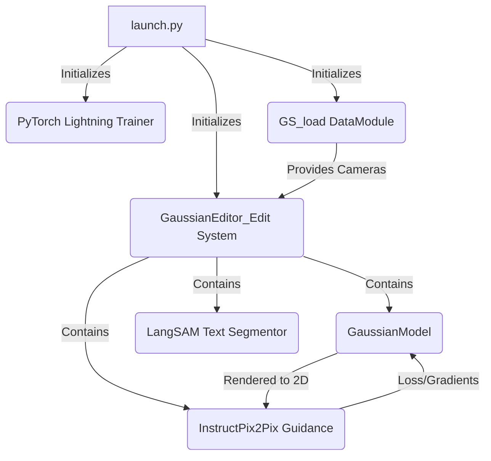
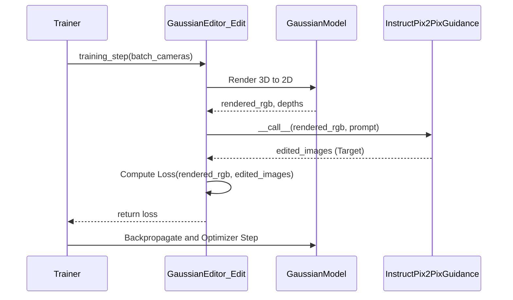

# GaussianEditor

## Overview

GaussianEditor is a 3D editing system that swift and controllably edits 3D scenes using Gaussian Splatting and 2D Diffusion Models. It relies on the [Threestudio](https://github.com/threestudio-project/threestudio) framework. This document provides a detailed overview of its core components, how they interact, and notable code implementations.

---

## 1. Core Components

The repository is structured to seamlessly integrate rendering and diffusion guidance. Below are the core components:

*   **`launch.py`**: The main entry point for running the system (train/test/validate/export modes). It loads the configuration, initializes PyTorch Lightning `Trainer`, and sets up the dataset and system via `threestudio` registry.
    *   [Link to `launch.py`, line 66](launch.py#L66) where `threestudio.find` initializes the system.
*   **`threestudio/systems/GassuianEditor.py`**: The foundational system logic managing the 3D Gaussian Splatting model. It inherits from `BaseLift3DSystem` and manages rendering logic, segmentation masks (using LangSAM), and PyTorch Lightning hooks (`on_before_optimizer_step`, `validation_step`, etc.).
    *   [Link to `GassuianEditor.py`, line 26](threestudio/systems/GassuianEditor.py#L26) defining `GaussianEditor(BaseLift3DSystem)`.
*   **`threestudio/systems/GassuianEditorEdit.py`**: A derivative of `GaussianEditor` specifically tailored for "Edit" mode tasks. It introduces 2D diffusion model guidance (InstructPix2Pix, etc.) to calculate the Nerf2Nerf/Perceptual/L1 losses, pulling the rendered Gaussians towards the diffusion model's edits.
    *   [Link to `GassuianEditorEdit.py`, line 11](threestudio/systems/GassuianEditorEdit.py#L11) defining `GaussianEditor_Edit(GaussianEditor)`.
*   **`threestudio/data/gs_load.py`**: The data module handling loading of datasets, managing camera poses, and creating the PyTorch Lightning `LightningDataModule`.
    *   [Link to `gs_load.py`, line 249](threestudio/data/gs_load.py#L249) defining `GS_load(pl.LightningDataModule)`.
*   **`threestudio/models/guidance/instructpix2pix_guidance.py`**: Implements 2D diffusion guidance using the InstructPix2Pix pipeline (`StableDiffusionInstructPix2PixPipeline`). It encodes images to latents, modifies them via text prompts, and uses Score Distillation Sampling (SDS) or direct pixel-space loss.
    *   [Link to `instructpix2pix_guidance.py`, line 14](threestudio/models/guidance/instructpix2pix_guidance.py#L14) defining `InstructPix2PixGuidance(BaseObject)`.
*   **Configuration Files (`configs/*.yaml`)**: Define training schedules, learning rates, prompt processors, and specific systems used (e.g., `gsedit-system-edit`).
    *   [Link to `configs/edit-n2n.yaml`, line 1](configs/edit-n2n.yaml#L1) defining a generic editing configuration.

---

## 2. Key Linkages

### Static Architecture

The `launch.py` script ties together the Data Module (`gs_load`), the Lift3DSystem (`GaussianEditor_Edit`), and the Trainer. The system itself contains the 3D Gaussian representations (`gaussiansplatting` submodules), the Renderer, and the Guidance Model (`InstructPix2PixGuidance`).

### Runtime Sequence

During a typical `training_step`, the following sequence of events occurs:

1.  The DataModule provides camera poses.
2.  The `GaussianEditor_Edit` system renders the current 3D Gaussian model into 2D images.
3.  The system passes the rendered 2D images to the `InstructPix2PixGuidance` model alongside a text prompt.
4.  The guidance model performs diffusion steps to generate a target "edited" 2D image.
5.  A loss (e.g., L1, Perceptual) is computed between the rendered image and the diffusion-edited target.
6.  Gradients are backpropagated to update the 3D Gaussian Model parameters (position, opacity, color, scale, rotation).

---

## 3. Important Implementations

### A. Semantic Mask Generation (LangSAM)
In `GaussianEditor.py`, the `update_mask` method allows for precise semantic targeting. Before editing begins, it uses a `LangSAMTextSegmentor` to identify regions matching a `seg_prompt`. The mask is then applied to the Gaussians' gradient mask (`apply_grad_mask`), ensuring only the targeted parts of the 3D scene are modified during optimization.
*   [Link to `GaussianEditor.py`, line 62](threestudio/systems/GassuianEditor.py#L62) - `update_mask(self, save_name="mask")` implementation.

### B. InstructPix2Pix Latent Editing
In `instructpix2pix_guidance.py`, the core editing logic lies within the `edit_latents` method. The 2D rendered images are mapped to the latent space via the VAE encoder. The diffusion UNet, conditioned on text embeddings and the original image latents (`image_cond_latents`), predicts noise. The `scheduler.step` iteratively removes noise to produce the target edit.
*   [Link to `instructpix2pix_guidance.py`, line 133](threestudio/models/guidance/instructpix2pix_guidance.py#L133) - `edit_latents` implementation.
*   The system can operate in a standard pixel loss mode (L1/Perceptual) by decoding these latents back to RGB, or it can use Score Distillation Sampling (SDS) if `use_sds: True` is set.
    *   [Link to `instructpix2pix_guidance.py`, line 232](threestudio/models/guidance/instructpix2pix_guidance.py#L232) - Returning SDS gradients or the decoded `edit_images`.

### C. Densification and Pruning
Standard to Gaussian Splatting, but elegantly hooked into PyTorch Lightning. In `GaussianEditor.py`'s `on_before_optimizer_step`, it accumulates gradients of the viewspace coordinates. Every `densification_interval` iterations, it clones or splits Gaussians with large gradients, and removes those with opacity below `min_opacity`.
*   [Link to `GaussianEditor.py`, line 219](threestudio/systems/GassuianEditor.py#L219) - `on_before_optimizer_step` managing densification.
